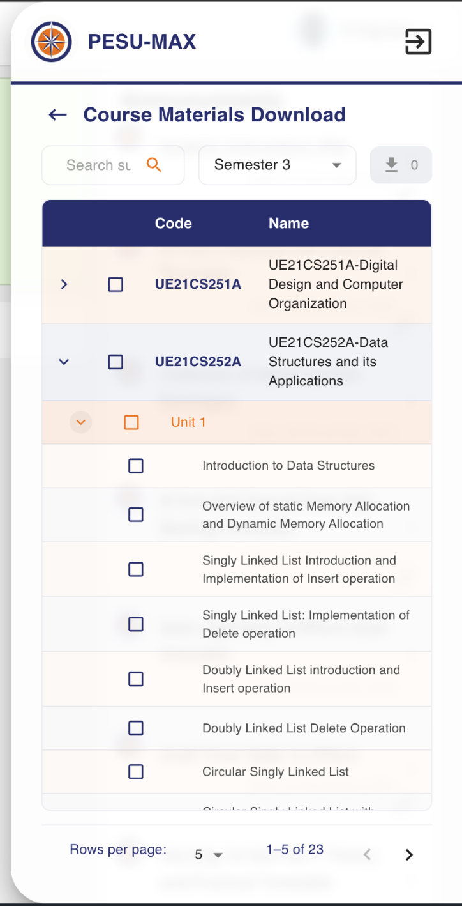
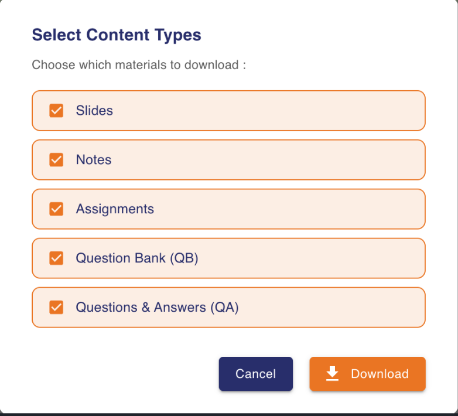
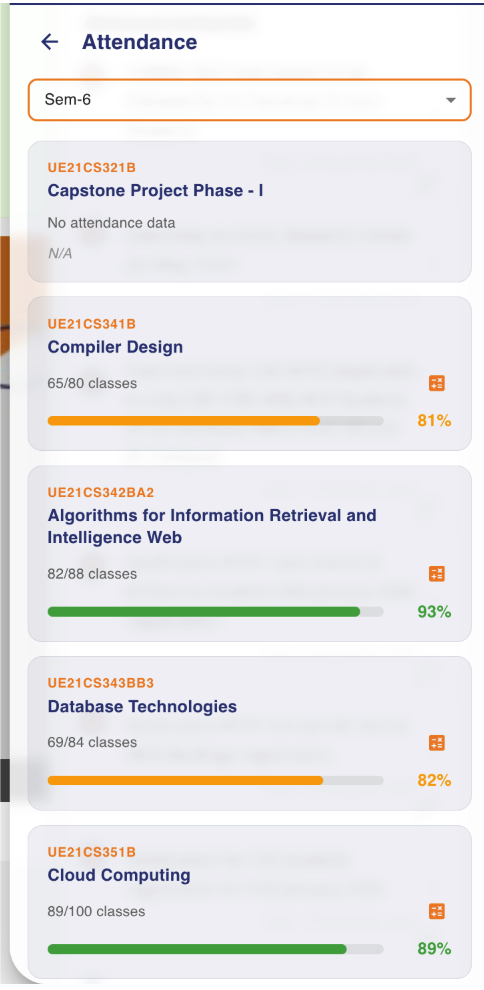
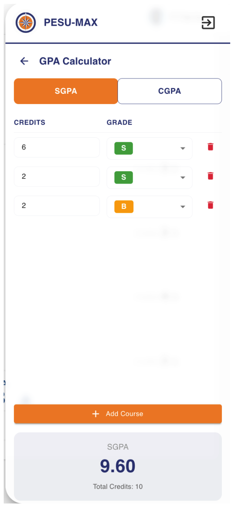
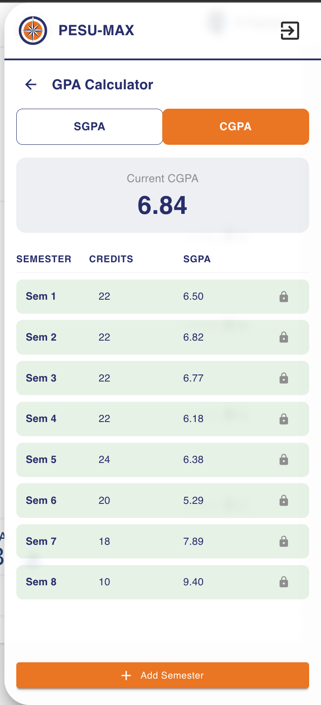

# PESU-MAX

PESU-MAX is a project that can be used to download pesu academy course content very quickly.
You can Download - Slides/Assignments/QA/QB all parellely across semesters/courses and class units.

## DEMO VIDEO
https://github.com/user-attachments/assets/f326dab6-3d37-4be4-a399-8b66b4d2739f


## NOTE

Login and load the package for faster auth.

Not an official package from PES University, made for only downloading resources quickly from PESU Academy.

All users data is stored locally in browser. NO proxy servers or External DB connected.

## Installation

```bash
git clone https://github.com/ndigvijay/PESU-MAX.git
```

```bash
cd PESU-MAX/
```

```bash
npm i
```

## Building the Extension

```bash
npm run build
```

Use the `dist/` folder to load the extension.

## FEATURES
- course content downloader *(across semesters,courses and units)*
- multi select course content types while downloading course materials
- Attendence calculator
- SGPA calculator
- CGPA calculator
- Faculty Information

## Screenshots

### Course Content Downloader
| Download Menu | Content Types |
|:-------------:|:-------------:|
|  |  |

### Attendance
| Menu | Statistics |
|:----:|:----------:|
|  |  |

### Calculators
| SGPA Calculator | CGPA Calculator |
|:---------------:|:---------------:|
|  |  |

### Faculty Information
| Menu | Profile |
|:----:|:-------:|
|  |  |
